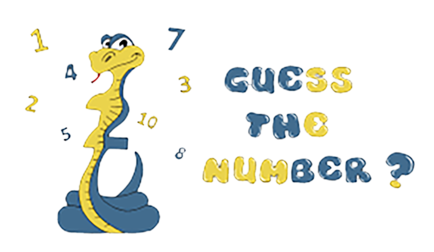

# "Guess-A-Number" Game
</img>

A simple console-based Java game.
Тhe player must guess the number the computer has chosen.
+ The game has 3 levels with the following rules:
 * Level 1 - the player has to guess a number in the range of 1 to 100. The player is allowed 10 tries.
  * Level 2 -  the player has to guess a number in the range of 1 to 200. The player is allowed 7 tries.
 * Level 3 -  the player has to guess a number in the range of 1 to 300. The player is allowed 5 tries.

Screenshot:
</img>

• [Source code](https://github.com/aChaushev/GuessANumberBy_aChaushev/blob/main/GuessANumber.java)
• ***by aChaushev***